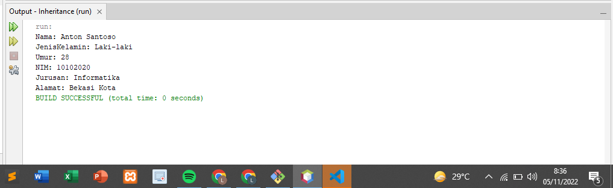
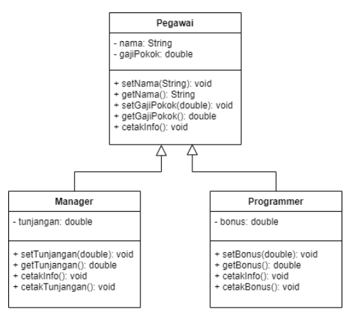

# latihanjava3
___
### Lengkapi latihan class Mahasiswa dengan setter dan getter.
• Mendeklarasikan <i>class manusia</i> yang merupakan superclass
```java 
        public class manusia {
            private String nama;
            private String jenisKelamin;
            private int umur;
            private String alamat;
            //setter
            public void setNama(String Nama) {
                this.nama = Nama;
            }
            public void setJenisKelamin(String JenisKelamin) {
                this.jenisKelamin = JenisKelamin;
            }
            public void setUmur(int Umur) {
                this.umur = Umur;
            }
            public void setAlamat(String Alamat) {
                this.alamat = Alamat;
            }
            // getter
            public String getNama() {
                return this.nama;
            }
            public String getJenisKelamin() {
                return this.jenisKelamin;
            }
            public int getUmur() {
                return this.umur;
            }
            public String getAlamat(){
                return this.alamat;
            }
        }
```
• Mendeklarasikan <i>class mahasiswa</i> yang merupakan subclass
```java 
        public class mahasiswa extends manusia {
            private String nim;
            private String jurusan;
            //setter
            public void setNIM(String NIM) {
                this.nim = NIM;
            }
            public void setJurusan(String Jurusan) {
                this.jurusan = Jurusan;
            }
            // getter
            public String getNIM() {
                return this.nim;
            }
            public String getJurusan() {
                return this.jurusan;
            }
        }
```
• Mendeklarasikan <i>class mahasiswaGo</i> yang merupakan class main
```java
        public class MahasiswaGo {

            public static void main(String[] args) {
                // Membuat object
                mahasiswa Anton = new mahasiswa();
                /* memanggil atribut dan memberi nilai */
                Anton.setNama("Anton Santoso");
                Anton.setJenisKelamin("Laki-laki");
                Anton.setUmur(28);
                Anton.setNIM("10102020");
                Anton.setAlamat("Bekasi Kota");
                Anton.setJurusan("Informatika");

                System.out.println("Nama: " + Anton.getNama());
                System.out.println("JenisKelamin: " + Anton.getJenisKelamin());
                System.out.println("Umur: " + Anton.getUmur());
                System.out.println("NIM: " + Anton.getNIM());
                System.out.println("Jurusan: " + Anton.getJurusan());
                System.out.println("Alamat: " + Anton.getAlamat());
            }
        }
```
• Hasil Run

___
___
### Implementasikan java code diagram class berikut:

• Mendeklarasikan <i>class pegawai</i> sebagai superclass
```java
        public class pegawai {

            private String nama;
            private double gajiPokok;

            public void setNama(String Nama) {
                this.nama = Nama;
            }
            public void setgajiPokok(double GajiPokok) {
                this.gajiPokok = GajiPokok;
            }
            public String getNama() {
                return this.nama;
            }
            public double getgajiPokok() {
                return this.gajiPokok;
            }
            public void cetakInfo(){
                System.out.println("Nama :"+ nama + "bagian" +  "\n Gaji :" + gajiPokok + "\n");
            } 
        }
```
• Mendeklarasikan <i>class Manager</i> yang merupakan subclass dari <i>class pegawai</i>
```java
        public class Manager extends pegawai {
            private double tunjangan;
            
            public void setTunjangan(double Tunjangan) {
                this.tunjangan = Tunjangan;
            }
            public double getTunjangan() {
                return this.tunjangan;
            }
            public void cetakInfo(){
                
            }
            public void cetakTunjangan(){
                
            }
        }
```
• Mendeklarasikan <i>class Programmer</i> yang merupakan subclass dari <i>class pegawai</i>
```java
        public class Programmer extends pegawai {
            private double bonus;
            
            public void setTunjangan(double Bonus) {
                this.bonus = Bonus;
            }
            public double getBonus() {
                return this.bonus;
            }
            public void cetakInfo(){
                
            }
            public void cetakBonus(){
                
            }
        }
```
___
<b>SELESAI</b>